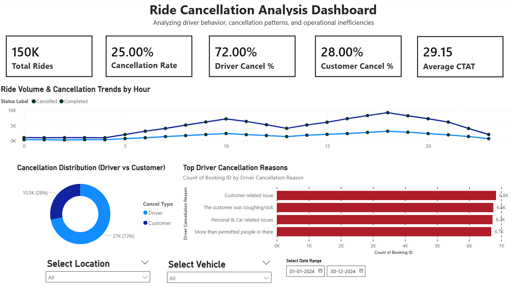

# Ride-cancellation-analysis
Power BI dashboard analyzing ride cancellations and driver behavior
# 🚕 Ride Cancellation Analysis Dashboard

## 📌 Overview
This project analyzes ride booking data to understand the key drivers of ride cancellations and identify actionable strategies to improve platform efficiency and customer experience.

The analysis is performed using Python for data processing and Power BI for interactive dashboard visualization.

---

## 🎯 Problem Statement
Ride cancellations are a major challenge in ride-hailing platforms, leading to:
- Poor customer experience
- Increased wait times
- Operational inefficiencies

This project aims to answer:
- Why are rides getting cancelled?
- Who is primarily responsible (driver vs customer)?
- When do cancellations occur the most?
- What actionable steps can reduce cancellations?

---

## 📊 Dataset
- ~150,000 ride records
- Key features include:
  - Booking Status
  - Pickup & Drop Location
  - Cancellation Reasons (Driver & Customer)
  - Wait Time (CTAT/VTAT)
  - Ride Distance
  - Ratings & Payment Method

---

## 🛠 Tools & Technologies
- **Python** (Pandas, NumPy) → Data cleaning & preprocessing  
- **SQL** → Data querying & transformation  
- **Power BI** → Dashboard & visualization  

---

## 🔎 Approach

### 1. Data Cleaning
- Handled missing values and inconsistencies
- Created derived columns:
  - `is_cancelled`
  - `driver_cancelled`
  - `customer_cancelled`
  - `hour` (for time-based analysis)

---

### 2. Exploratory Data Analysis
- Calculated overall cancellation rate
- Segmented cancellations by:
  - Driver vs Customer
  - Time (hourly trends)
  - Location
- Analyzed cancellation reasons

---

### 3. Visualization (Power BI)
Developed an interactive dashboard with:
- KPI cards (Total Rides, Cancellation Rate, Driver vs Customer %)
- Time trend analysis (hourly cancellations)
- Cancellation distribution (Driver vs Customer)
- Top driver cancellation reasons
- Interactive filters (Date, Location, Vehicle Type)

---

## 🔍 Key Insights

- ~25% of rides are cancelled
- ~70–80% of cancellations are **driver-driven**
- Peak cancellations occur during **evening hours**
- Many “customer cancellations” are indirectly caused by **driver behavior**
- Major driver issues include:
  - Communication gaps
  - Operational inefficiencies
  - Pickup-related challenges

---

## 💡 Business Recommendations

Based on the analysis, the following strategies are proposed:

- **Driver Reliability Scoring**  
  Track and rank drivers based on cancellation behavior

- **Penalty for Forced Cancellations**  
  Identify and penalize drivers asking customers to cancel

- **Peak Hour Incentives**  
  Encourage ride completion during high-demand periods

- **Auto-Reassignment System**  
  Reassign drivers if inactivity is detected

- **Improved Booking UX**  
  Reduce customer errors (wrong address, plan changes)

---

## 📸 Dashboard Preview

---

## 🚀 Impact

This analysis provides actionable insights to:
- Reduce ride cancellations
- Improve customer satisfaction
- Enhance operational efficiency
- Support data-driven product decisions

---

## 📂 Repository Structure
# 🚕 Ride Cancellation Analysis Dashboard

## 📌 Overview
This project analyzes ride booking data to understand the key drivers of ride cancellations and identify actionable strategies to improve platform efficiency and customer experience.

The analysis is performed using Python for data processing and Power BI for interactive dashboard visualization.

---

## 🎯 Problem Statement
Ride cancellations are a major challenge in ride-hailing platforms, leading to:
- Poor customer experience
- Increased wait times
- Operational inefficiencies

This project aims to answer:
- Why are rides getting cancelled?
- Who is primarily responsible (driver vs customer)?
- When do cancellations occur the most?
- What actionable steps can reduce cancellations?

---

## 📊 Dataset
- ~150,000 ride records
- Key features include:
  - Booking Status
  - Pickup & Drop Location
  - Cancellation Reasons (Driver & Customer)
  - Wait Time (CTAT/VTAT)
  - Ride Distance
  - Ratings & Payment Method

---

## 🛠 Tools & Technologies
- **Python** (Pandas, NumPy) → Data cleaning & preprocessing  
- **SQL** → Data querying & transformation  
- **Power BI** → Dashboard & visualization  

---

## 🔎 Approach

### 1. Data Cleaning
- Handled missing values and inconsistencies
- Created derived columns:
  - `is_cancelled`
  - `driver_cancelled`
  - `customer_cancelled`
  - `hour` (for time-based analysis)

---

### 2. Exploratory Data Analysis
- Calculated overall cancellation rate
- Segmented cancellations by:
  - Driver vs Customer
  - Time (hourly trends)
  - Location
- Analyzed cancellation reasons

---

### 3. Visualization (Power BI)
Developed an interactive dashboard with:
- KPI cards (Total Rides, Cancellation Rate, Driver vs Customer %)
- Time trend analysis (hourly cancellations)
- Cancellation distribution (Driver vs Customer)
- Top driver cancellation reasons
- Interactive filters (Date, Location, Vehicle Type)

---

## 🔍 Key Insights

- ~25% of rides are cancelled
- ~70–80% of cancellations are **driver-driven**
- Peak cancellations occur during **evening hours**
- Many “customer cancellations” are indirectly caused by **driver behavior**
- Major driver issues include:
  - Communication gaps
  - Operational inefficiencies
  - Pickup-related challenges

---

## 💡 Business Recommendations

Based on the analysis, the following strategies are proposed:

- **Driver Reliability Scoring**  
  Track and rank drivers based on cancellation behavior

- **Penalty for Forced Cancellations**  
  Identify and penalize drivers asking customers to cancel

- **Peak Hour Incentives**  
  Encourage ride completion during high-demand periods

- **Auto-Reassignment System**  
  Reassign drivers if inactivity is detected

- **Improved Booking UX**  
  Reduce customer errors (wrong address, plan changes)

---

## 📸 Dashboard Preview

---

## 🚀 Impact

This analysis provides actionable insights to:
- Reduce ride cancellations
- Improve customer satisfaction
- Enhance operational efficiency
- Support data-driven product decisions

---

## 📂 Repository Structure
ride-cancellation-analysis/
│
├── data/
├── dashboard/
├── notebooks/
└── README.md
---

## 💼 Key Learning

This project demonstrates:
- End-to-end data analysis workflow  
- Business problem solving using data  
- Dashboard storytelling & visualization  
- Product-oriented thinking  

---
